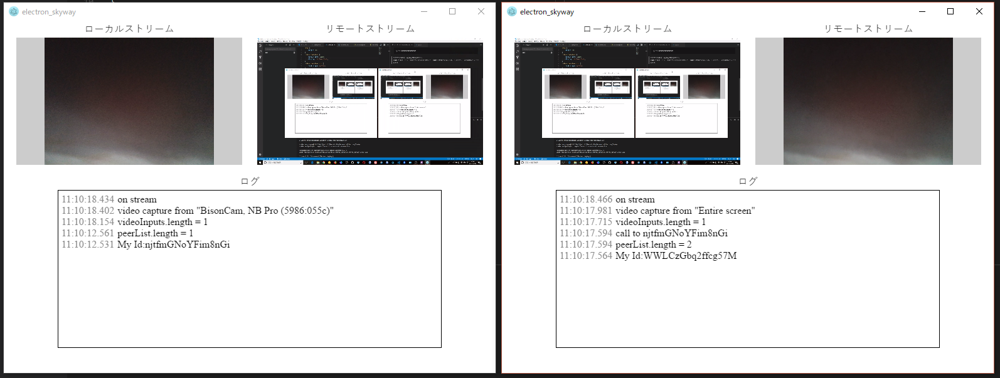

# Electron_SkyWay for Ishiguro Lab

ElectronでSkyWayを使うサンプルアプリ [Electron_Skyway](https://github.com/turbographics2000/Electron_SkyWay) を少し修正したアプリです。

## 前準備

1. Skyway というサービスを使ってビデオ通信（WebRTC）を行います
    * 事前に[こちらから](https://webrtc.ecl.ntt.com/)無料版に会員登録して、 API キーを作成してください
    * **注意：APIキーの設定を変更し、「利用可能ドメイン」に "electron" と入力して保存しておいてください**

2. git と Node.js を PC にインストールしてください。
    * **注意：Node.js はバージョン `12.3.1` をインストールしてください**
    * 他のバージョンでも動くかもしれませんが、保証しません


## 使い方

Mac/Linux の例です。Windows も Powershell を使用すれば同様のことができると思います。

1. Github からリポジトリをクローンしてきます。または、この Github 上の Code（緑のボタン） > Download Zip でファイルをダウンロードしてください。

    ```
    $ git clone https://github.com/baba5246/Electron_SkyWay.git
    ```

2. Terminal または Powershell でフォルダ内に移動し、ライブラリをインストールします

    ```
    $ cd Electron_Skyway
    $ npm install
    ```

3. window.js の変数 `SkyWay_ApiKey` に作成した Skyway の API キーを入力します

3. デスクトップアプリを作成します

    ```
    $ npm run build
    ```

    * 上記を実行すると、Windows, Mac, Linuxの３つのパッケージが作成されます
    * 個別にパッケージを作成したい場合は、以下のいずれかを実行します。

        ```
        $ npm run build_win
        $ npm run build_linux
        $ npm run build_mac
        ```

4. 作成された実行ファイル実行します。
    * ログに以下が表示されれば成功です
        ```
        My Id:XXXXXXXXXXXXXXXX
        ```
    * 起動したまま、もう一つ実行ファイルを実行すると、自動的に接続されカメラもしくはスクリーンの映像がシェアされます。




## Electron 上の JavaScript から Sota にコマンドを送るには

Electron は、HTML, CSS, JavaScript で作ったWebサービス・Webサイトを、デスクトップアプリにするためのツールです。
今回、ビデオ通信をするために使用した Skyway は、主にブラウザ上での利用を想定したサービスです。
しかし、ブラウザ上の JavaScript はセキュリティの観点で、PCのローカル（ファイルや通信）にアクセスする権限を持てません。
そこで、Skyway でやりとりした情報を、PCのローカル通信を通してSotaに送るために Electron を使用しています。

Electron は Web コンテンツの表示・制御を行うレンダラープロセスと、ローカルのプログラムとして動作するメインプロセスに分かれています。

* メインプロセスは `app.js` を読み込み、デスクトップアプリのウィンドウを作成します
* レンダラープロセスは作成されたウィンドウの中で、 `window.html`, `window.js`, `style.css` を読み込み、ブラウザと同様の制御・表示を行います
* 参考：https://postd.cc/essential-electron/

上記を踏まえると、情報を受け取った後に Sota にコマンドを送るには下記の手順をすることになります。
参考サイトなどを見ながら試行錯誤して見てください。

1. `ipcMain` や `ipcRenderer` を用いて、`window.js` から `app.js` に情報を送る
    * 参考：https://webbibouroku.com/Blog/Article/electron-ipc#outline__4_1

2. `app.js` でSota へのTCP通信クライアントを作り、情報を受け取ったら Sota に送信する
    * Sota へのコマンドの送り方は `app.js` の下部にサンプルが書いてあるので、参考にしてください。

## Sota に送れるコマンド一覧

[こちら](https://github.com/baba5246/Electron_SkyWay/blob/master/README_SotaManager.md)を参照

